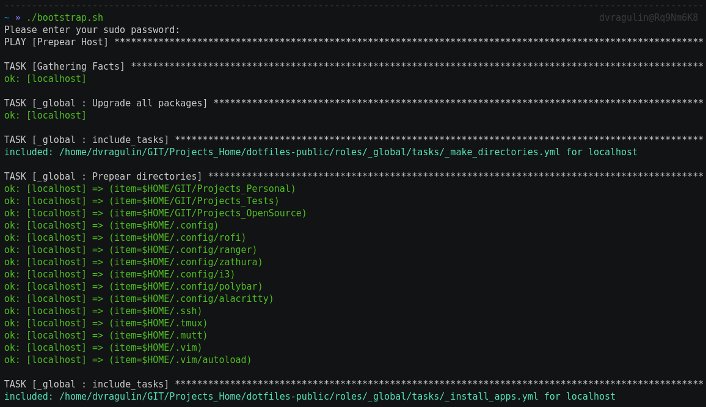

# Dotfiles

Personal ansible roles for apply i3/KDE configuration on Manjaro Linux KDE.

#### Usage
```
wget -c https://raw.githubusercontent.com/dvragulin/dotfiles-public/master/bin/bootstrap.sh && chmod +x ./bootstrap.sh && ./bootstrap.sh
```
#### Available roles

  - _global
  - alacritty
  - avatars
  - bash
  - feedbro
  - git
  - gtk
  - i3
  - mc
  - polybar
  - ranger
  - rofi
  - ssh
  - tmux
  - vim
  - wallpapers
  - xinit
  - zathura
  - zsh

# Watch installation on asciinema
[](https://asciinema.org/a/xixWcDhLGiSiOcNWFpzXshYh6)
# Desktop view
[](https://raw.githubusercontent.com/dvragulin/dotfiles-public/master/.media/screen_2.png)

#### TODO

- [ ] Dotfiles:
    - [ ] vim  (auto-updates)
    - [ ] zsh  (auto-updates)
    - [ ] tmux (auto-updates)
